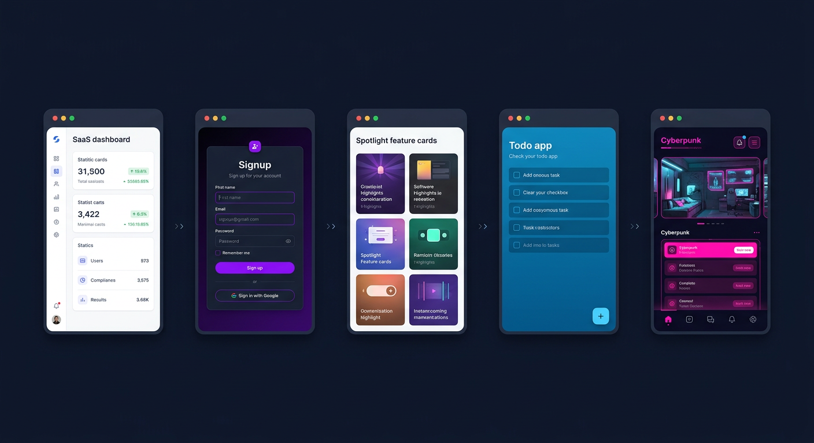
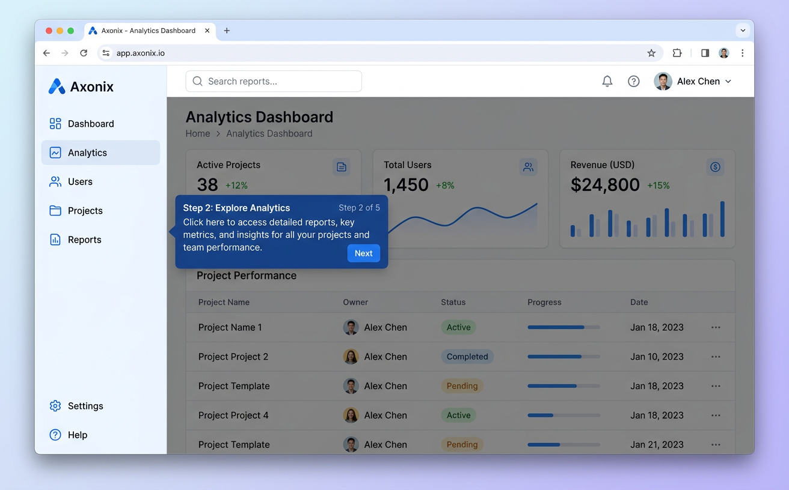
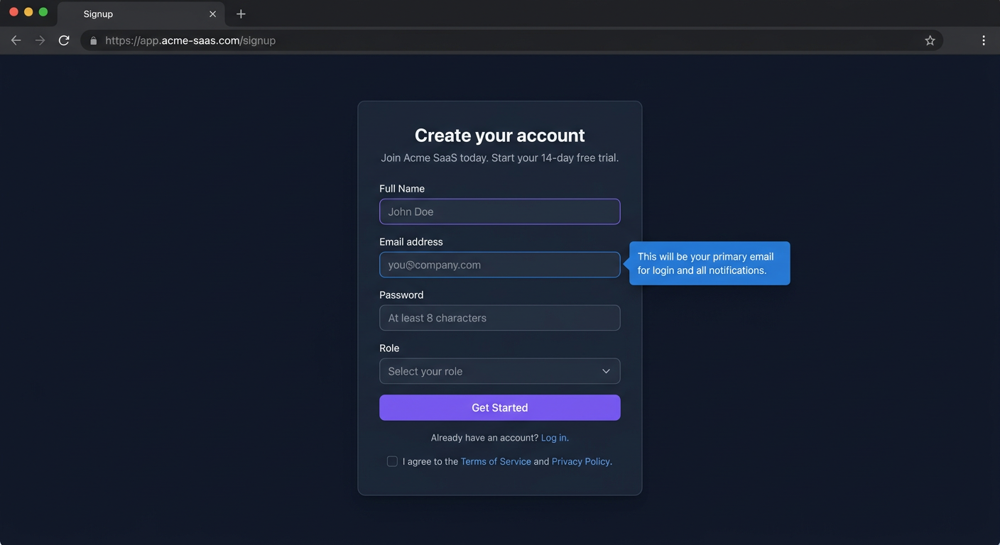
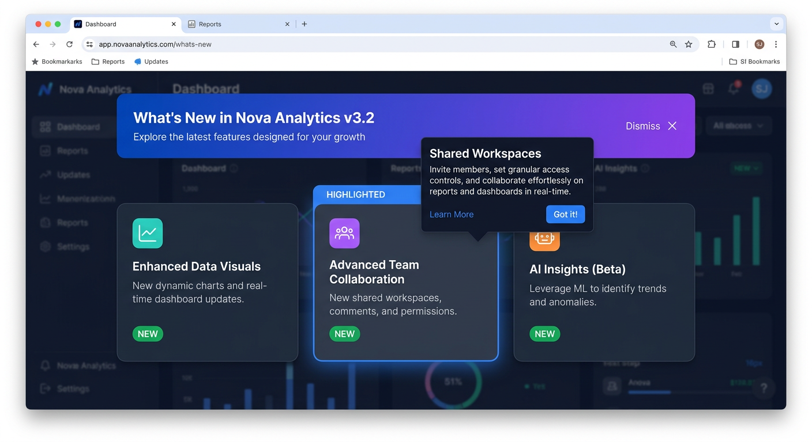
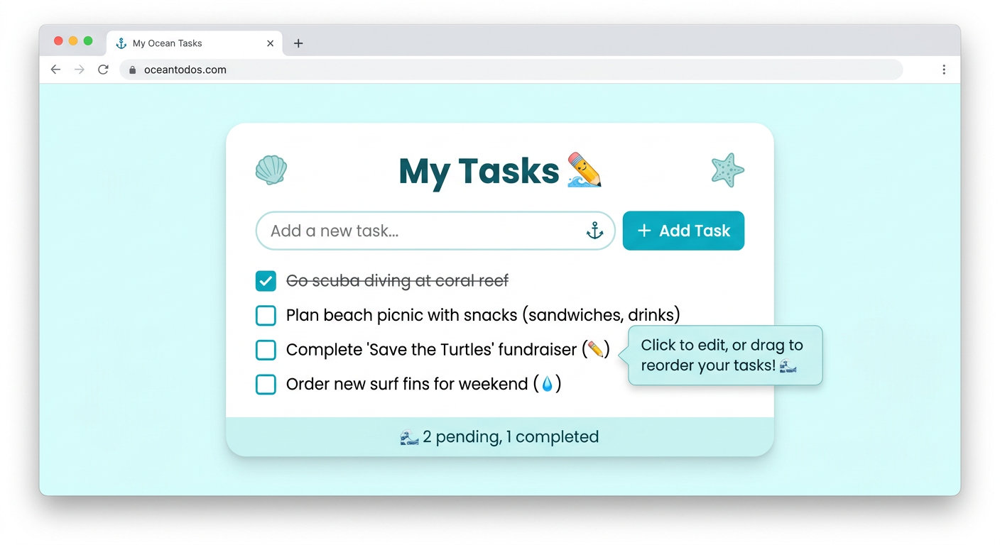
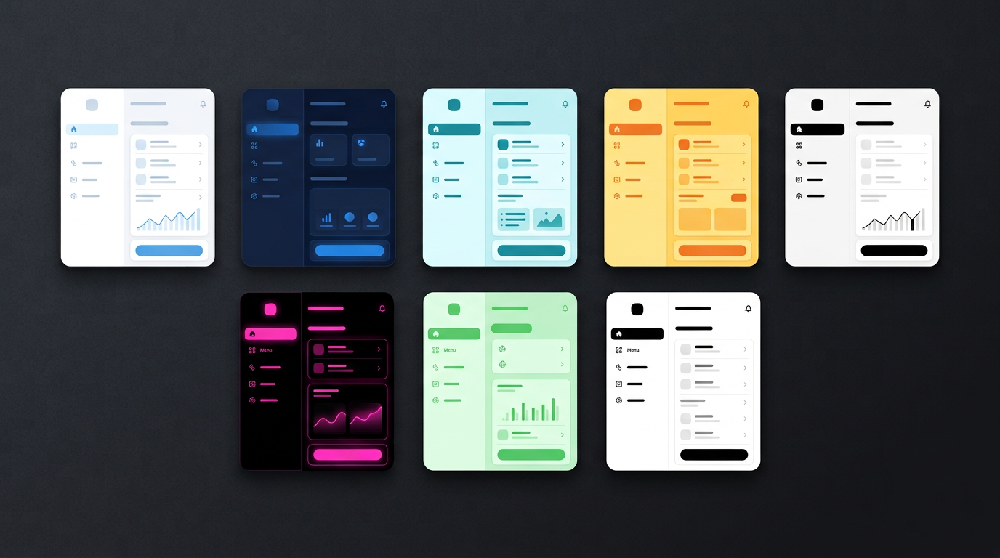
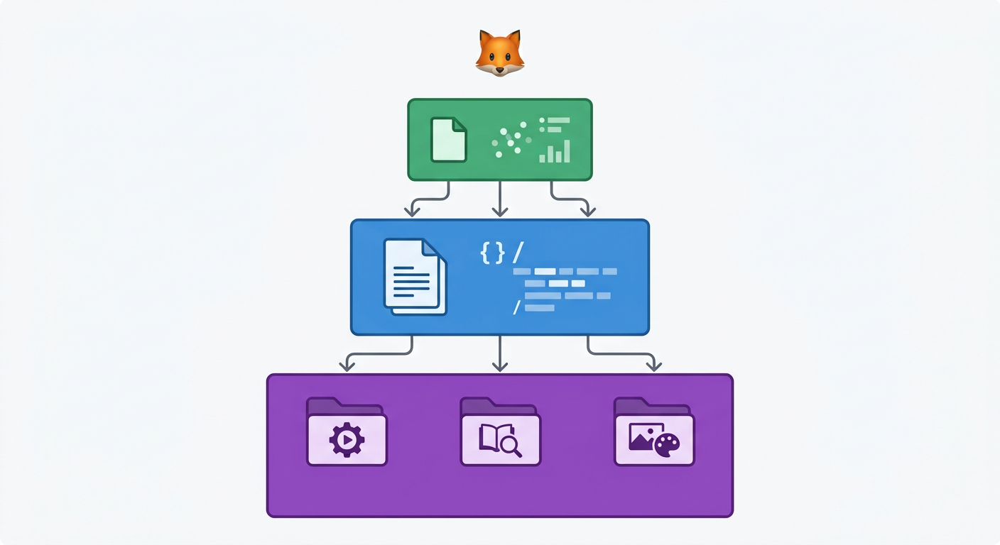

<!-- ═══════════════════════════════════════════════════════════════
     🦊 driverjs-demo — Interactive Product Tours for Every Agent
     ═══════════════════════════════════════════════════════════════ -->

<p align="center">
  
</p>

<h1 align="center"><code>driverjs-demo</code></h1>

<p align="center">
  <strong>Interactive product tours, onboarding flows & guided demos</strong><br/>
  <em>One skill. Every AI agent. Zero dependencies.</em>
</p>

<p align="center">
  <a href="https://agentskills.io"></a>
  <a href="https://driverjs.com"></a>
  <a href="LICENSE"></a>
  
  
  
</p>

<p align="center">
  <a href="#-quick-start">Install</a> &nbsp;·&nbsp;
  <a href="#-demo-gallery">Gallery</a> &nbsp;·&nbsp;
  <a href="#-compatibility">Compatibility</a> &nbsp;·&nbsp;
  <a href="#-themes">Themes</a> &nbsp;·&nbsp;
  <a href="#-how-it-works">How It Works</a> &nbsp;·&nbsp;
  <a href="references/examples/">Live Demos</a>
</p>

---

## What is this?

`driverjs-demo` is an **Agent Skill** ([SKILL.md](https://agentskills.io) format) that teaches any AI coding agent to generate **beautiful, self-contained HTML demos** using [Driver.js](https://driverjs.com) — the lightweight library for product tours used by **Red Hat, Alibaba, Intel, Fiverr**, and downloaded **4M+ times/month**.

Your agent reads the skill, understands your request, and writes a single `.html` file. Open it in any browser. Done.

<p align="center">
  
</p>

```
You:     "Create a product tour for my SaaS dashboard with a dark theme"
Agent:   reads skill → picks pattern → applies theme → writes dashboard-tour.html
You:     open dashboard-tour.html → 🦊 beautiful interactive tour
```

---

## ⚡ Quick Start

### Install for your agent

```bash
git clone https://github.com/mohamed-amine-ben-mallessa/driverjs-demo-agent-skill.git driverjs-demo
```

Then copy (or symlink) the `driverjs-demo/` folder where your agent looks for skills:

<table>
<tr>
<td width="50%">

**Claude Code**
```bash
cp -r driverjs-demo ~/.claude/skills/
```

**Codex CLI**
```bash
cp -r driverjs-demo ~/.agents/skills/
```

**Gemini CLI**
```bash
cp -r driverjs-demo ~/.gemini/skills/
```

</td>
<td width="50%">

**Cursor 2.4+**
```bash
cp -r driverjs-demo .cursor/skills/
```

**Windsurf / Cline / Roo**
```bash
cp -r driverjs-demo .agents/skills/
```

**OpenClaw / Amp / Kilo**
```bash
cp -r driverjs-demo ~/.openclaw/skills/
```

</td>
</tr>
</table>

<details>
<summary><b>🔗 Universal install — one copy, every agent (symlinks)</b></summary>

```bash
# Install once, symlink everywhere
cp -r driverjs-demo ~/.agents/skills/
ln -s ~/.agents/skills/driverjs-demo ~/.claude/skills/driverjs-demo
ln -s ~/.agents/skills/driverjs-demo ~/.gemini/skills/driverjs-demo
ln -s ~/.agents/skills/driverjs-demo ~/.codex/skills/driverjs-demo
```

Or use the included script:

```bash
./scripts/install.sh --global
```
</details>

### Then just ask

<table>
<tr>
<td width="50%">

```
"Create a product tour for my app"
"Build an onboarding walkthrough"
"Make a signup form wizard"
```

</td>
<td width="50%">

```
"Generate a What's New spotlight"
"Create an interactive tutorial"
"Make a settings page guide"
```

</td>
</tr>
</table>

Your agent reads the skill → picks the right pattern → generates a **single `.html` file** → open in browser. Done.

---

## 🎬 Demo Gallery

Five live demos included — open any `.html` file in your browser.

### 🚶 Product Tour — SaaS Dashboard

<a href="references/examples/02-saas-dashboard.html">
  
</a>

### 📝 Form Guidance — Dark Mode

<a href="references/examples/03-form-wizard.html">
  
</a>

### ✨ Feature Spotlight — What's New

<a href="references/examples/04-feature-spotlight.html">
  
</a>

### 🎮 Interactive Tutorial — Hands-on

<a href="references/examples/05-interactive-tutorial.html">
  
</a>

<p align="center">
  <a href="references/examples/">📂 Browse all 5 demos</a>
</p>

---

## 🧩 Five Patterns

| Pattern | Use case | Driver.js superpower |
|:--------|:---------|:---------------------|
| 🚶 **Product Tour** | Onboarding, app walkthrough | `showProgress` · `smoothScroll` · `animate` |
| 📝 **Form Guidance** | Signup, checkout, settings | `disableActiveInteraction: false` (user can type!) |
| ✨ **Feature Spotlight** | What's New, feature adoption | Light overlay (`opacity: 0.15`) keeps UI visible |
| 🎮 **Interactive Tutorial** | Learn-by-doing, setup wizards | `advanceOnClick` · `waitForElement` |
| 💡 **Feature Hints** | Persistent beacons (not a tour) | `hints()` API — separate from tours |

---

## 🌐 Compatibility

Built on the **[Agent Skills Open Standard](https://agentskills.io)** — one file, every agent.

<table>
<tr>
<th>Agent</th>
<th>Install Path</th>
<th>Auto</th>
<th>Slash</th>
</tr>
<tr>
<td><b>Claude Code</b></td>
<td><code>~/.claude/skills/</code></td>
<td>✅</td>
<td><code>/driverjs-demo</code></td>
</tr>
<tr>
<td><b>OpenAI Codex CLI</b></td>
<td><code>~/.agents/skills/</code></td>
<td>✅</td>
<td><code>$driverjs-demo</code></td>
</tr>
<tr>
<td><b>Gemini CLI</b></td>
<td><code>~/.gemini/skills/</code></td>
<td>✅</td>
<td><code>/driverjs-demo</code></td>
</tr>
<tr>
<td><b>Cursor 2.4+</b></td>
<td><code>.cursor/skills/</code></td>
<td>✅</td>
<td>✅</td>
</tr>
<tr>
<td><b>Windsurf</b></td>
<td><code>.agents/skills/</code></td>
<td>✅</td>
<td>✅</td>
</tr>
<tr>
<td><b>Cline</b></td>
<td><code>.cline/skills/</code></td>
<td>✅</td>
<td>✅</td>
</tr>
<tr>
<td><b>Roo Code</b></td>
<td><code>.agents/skills/</code></td>
<td>✅</td>
<td>✅</td>
</tr>
<tr>
<td><b>OpenClaw</b></td>
<td><code>~/.openclaw/skills/</code></td>
<td>✅</td>
<td>✅</td>
</tr>
<tr>
<td><b>GitHub Copilot</b></td>
<td><code>.agents/skills/</code></td>
<td>⚠️</td>
<td>⚠️</td>
</tr>
<tr>
<td><b>Amp</b></td>
<td><code>.agents/skills/</code></td>
<td>✅</td>
<td>✅</td>
</tr>
<tr>
<td><b>Kilo</b></td>
<td><code>.agents/skills/</code></td>
<td>✅</td>
<td>✅</td>
</tr>
<tr>
<td><b>Kiro CLI</b></td>
<td><code>.agents/skills/</code></td>
<td>✅</td>
<td>✅</td>
</tr>
<tr>
<td><b>Zed</b></td>
<td><code>.agents/skills/</code></td>
<td>⚠️</td>
<td>⚠️</td>
</tr>
</table>

> ✅ Full support &nbsp;·&nbsp; ⚠️ Partial / experimental

---

## 🎨 Themes

Seven ready-made themes. Each includes CSS variables **and** Driver.js overlay/popover config.

<p align="center">
  
</p>

| | Theme | Background | Primary | Vibe |
|:-:|:------|:-----------|:--------|:-----|
| ☀️ | **light** | `#f8fafc` | `#3b82f6` | Clean, professional |
| 🌙 | **dark** | `#0f172a` | `#3b82f6` | Sleek, modern |
| 🌊 | **ocean** | `#ecfeff` | `#06b6d4` | Fresh, calm |
| 🌅 | **sunset** | `#fefce8` | `#f59e0b` | Warm, inviting |
| 💜 | **cyberpunk** | `#0a0a0f` | `#ff006e` | Neon, edgy |
| 🌿 | **mint** | `#f0fdf4` | `#22c55e` | Natural, light |
| ⬛ | **mono** | `#fafafa` | `#171717` | Minimal, stark |

---

## 🔧 How It Works

### Progressive Disclosure

The skill loads in 3 levels to keep your agent's context window lean:

<p align="center">
  
</p>

```
┌─────────────────────────────────────────────────────────┐
│  Level 1  ·  Metadata loaded at startup (~100 tokens)   │
│  name + description — agent knows the skill exists      │
├─────────────────────────────────────────────────────────┤
│  Level 2  ·  Instructions loaded on activation (<5k)    │
│  Full SKILL.md body — agent follows the procedure       │
├─────────────────────────────────────────────────────────┤
│  Level 3  ·  Resources loaded on demand                 │
│  assets/*.js → step templates                           │
│  references/ → cheatsheet, examples                     │
│  scripts/    → CLI builder                              │
└─────────────────────────────────────────────────────────┘
```

### CLI Builder

```bash
node scripts/build.js --type tour        --theme dark       --name Acme  --output demo.html
node scripts/build.js --type form        --theme cyberpunk  --output signup.html
node scripts/build.js --type spotlight   --theme ocean      --output features.html
node scripts/build.js --type interactive --theme light      --output tutorial.html
```

| Flag | Values |
|:-----|:-------|
| `--type` | `tour` · `form` · `spotlight` · `interactive` |
| `--theme` | `light` · `dark` · `ocean` · `sunset` · `cyberpunk` · `mint` · `mono` |
| `--name` | Your app name (default: `MyApp`) |
| `--output` | Output path (default: `demo.html`) |

---

## 📁 Structure

```
driverjs-demo/
├── SKILL.md                    ← Agent manifest (open standard)
├── README.md                   ← You're here
├── LICENSE                     ← MIT
│
├── scripts/
│   ├── build.js                ← CLI generator (4 types × 7 themes)
│   └── install.sh              ← Cross-agent installer (symlinks)
│
├── references/
│   ├── cheatsheet.md           ← Driver.js API + theme reference
│   └── examples/
│       ├── 01-basic-tour.html  ← Simple navbar tour
│       ├── 02-saas-dashboard.html  ← Full dashboard walkthrough
│       ├── 03-form-wizard.html     ← Dark-mode signup guide
│       ├── 04-feature-spotlight.html ← What's New spotlight
│       └── 05-interactive-tutorial.html ← Hands-on todo app
│
└── assets/
    ├── product-tour.js         ← Tour step template
    ├── feature-hints.js        ← Hints + spotlight template
    ├── form-guidance.js        ← Form guidance template
    └── interactive-tour.js     ← Interactive tutorial template
```

---

## 🤝 Contributing

<details>
<summary><b>Add a theme</b></summary>

1. Edit `references/cheatsheet.md` — add CSS vars + Driver.js config
2. Edit `scripts/build.js` — add entry to `themes` object
3. Open a PR with a screenshot
</details>

<details>
<summary><b>Add a pattern</b></summary>

1. Create `assets/your-pattern.js` — export a step config function
2. Update `SKILL.md` — add pattern to workflow section
3. Add an example in `references/examples/`
4. Open a PR
</details>

<details>
<summary><b>Add agent-specific config</b></summary>

If your agent supports a sidecar (e.g. `agents/openai.yaml` for Codex), add it alongside `SKILL.md`. The standard skill must always work standalone.
</details>

---

## 📄 License

**MIT** — same as [Driver.js](https://github.com/kamranahmedse/driver.js).

Free for personal and commercial use. No attribution required.

---

<p align="center">
  <strong>⭐ If this project helps you, consider giving it a star!</strong><br/>
  <sub>It helps others discover it and keeps us motivated to ship more features.</sub>
</p>

<p align="center">
  <sub>Built with the <a href="https://agentskills.io">Agent Skills Open Standard</a></sub><br/>
  <sub>Powered by <a href="https://driverjs.com">Driver.js</a> · ~5kb · No dependencies · MIT</sub>
</p>
